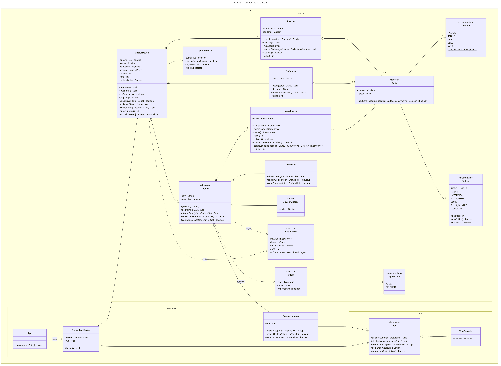
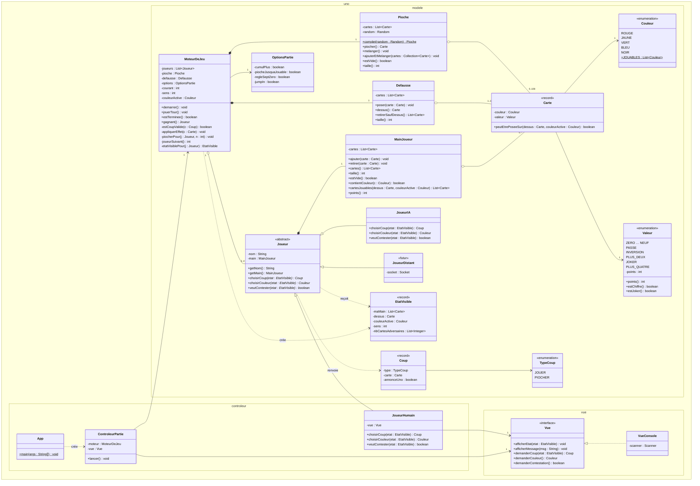

# Diagramme de classes — Uno Java

Source Mermaid (rendue directement par GitHub) :

```mermaid
classDiagram
direction TB

namespace uno.modele {
    class Couleur {
        <<enumeration>>
        ROUGE
        JAUNE
        VERT
        BLEU
        NOIR
        +JOUABLES : List~Couleur~$
    }

    class Valeur {
        <<enumeration>>
        ZERO … NEUF
        PASSE
        INVERSION
        PLUS_DEUX
        JOKER
        PLUS_QUATRE
        -points : int
        +points() int
        +estChiffre() boolean
        +estJoker() boolean
    }

    class Carte {
        <<record>>
        -couleur : Couleur
        -valeur : Valeur
        +peutEtrePoseeSur(dessus : Carte, couleurActive : Couleur) boolean
    }

    class Pioche {
        -cartes : List~Carte~
        -random : Random
        +complet(random : Random)$ Pioche
        +piocher() Carte
        +melanger() void
        +ajouterEtMelanger(cartes : Collection~Carte~) void
        +estVide() boolean
        +taille() int
    }

    class Defausse {
        -cartes : List~Carte~
        +poser(carte : Carte) void
        +dessus() Carte
        +retirerSaufDessus() List~Carte~
        +taille() int
    }

    class MainJoueur {
        -cartes : List~Carte~
        +ajouter(carte : Carte) void
        +retirer(carte : Carte) void
        +cartes() List~Carte~
        +taille() int
        +estVide() boolean
        +contientCouleur(c : Couleur) boolean
        +cartesJouables(dessus : Carte, couleurActive : Couleur) List~Carte~
        +points() int
    }

    class Joueur {
        <<abstract>>
        -nom : String
        -main : MainJoueur
        +getNom() String
        +getMain() MainJoueur
        +choisirCoup(etat : EtatVisible)* Coup
        +choisirCouleur(etat : EtatVisible)* Couleur
        +veutContester(etat : EtatVisible)* boolean
    }

    class JoueurIA {
        +choisirCoup(etat : EtatVisible) Coup
        +choisirCouleur(etat : EtatVisible) Couleur
        +veutContester(etat : EtatVisible) boolean
    }

    class JoueurDistant {
        <<futur>>
        -socket : Socket
    }

    class EtatVisible {
        <<record>>
        -maMain : List~Carte~
        -dessus : Carte
        -couleurActive : Couleur
        -sens : int
        -nbCartesAdversaires : List~Integer~
    }

    class Coup {
        <<record>>
        -type : TypeCoup
        -carte : Carte
        -annonceUno : boolean
    }

    class TypeCoup {
        <<enumeration>>
        JOUER
        PIOCHER
    }

    class OptionsPartie {
        -cumulPlus : boolean
        -piocheJusquaJouable : boolean
        -regleSeptZero : boolean
        -jumpIn : boolean
    }

    class MoteurDeJeu {
        -joueurs : List~Joueur~
        -pioche : Pioche
        -defausse : Defausse
        -options : OptionsPartie
        -courant : int
        -sens : int
        -couleurActive : Couleur
        +demarrer() void
        +jouerTour() void
        +estTerminee() boolean
        +gagnant() Joueur
        -estCoupValide(c : Coup) boolean
        -appliquerEffet(c : Carte) void
        -piocherPour(j : Joueur, n : int) void
        -joueurSuivant() int
        -etatVisiblePour(j : Joueur) EtatVisible
    }
}

namespace uno.vue {
    class Vue {
        <<interface>>
        +afficherEtat(etat : EtatVisible) void
        +afficherMessage(msg : String) void
        +demanderCoup(etat : EtatVisible) Coup
        +demanderCouleur() Couleur
        +demanderContestation() boolean
    }

    class VueConsole {
        -scanner : Scanner
    }
}

namespace uno.controleur {
    class JoueurHumain {
        -vue : Vue
        +choisirCoup(etat : EtatVisible) Coup
        +choisirCouleur(etat : EtatVisible) Couleur
        +veutContester(etat : EtatVisible) boolean
    }

    class ControleurPartie {
        -moteur : MoteurDeJeu
        -vue : Vue
        +lancer() void
    }

    class App {
        +main(args : String[])$ void
    }
}

Carte --> "1" Couleur
Carte --> "1" Valeur
Pioche o-- "0..108" Carte
Defausse o-- "1..108" Carte
MainJoueur o-- "0..*" Carte

Joueur *-- "1" MainJoueur
Joueur <|-- JoueurIA
Joueur <|-- JoueurHumain
Joueur <|-- JoueurDistant
Joueur ..> EtatVisible : reçoit
Joueur ..> Coup : renvoie
Coup --> TypeCoup

MoteurDeJeu "1" o-- "2..4" Joueur
MoteurDeJeu *-- "1" Pioche
MoteurDeJeu *-- "1" Defausse
MoteurDeJeu --> "1" OptionsPartie
MoteurDeJeu ..> EtatVisible : crée

Vue <|.. VueConsole
JoueurHumain --> "1" Vue
ControleurPartie --> "1" MoteurDeJeu
ControleurPartie --> "1" Vue
App ..> ControleurPartie : crée
```
